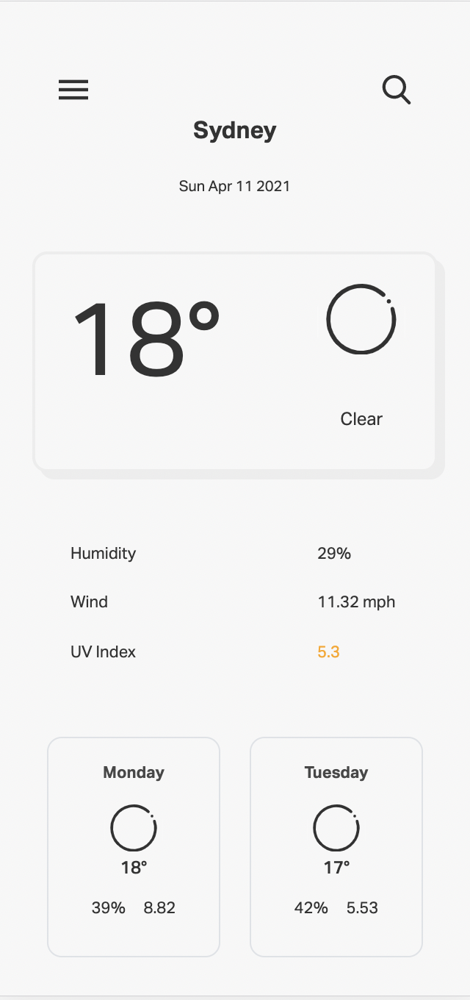
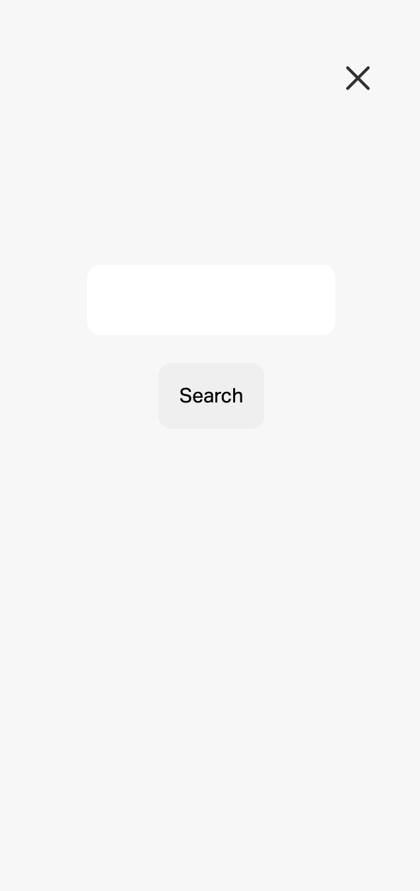

# Weather Dashboard

## How does it work?

This app allows you to gather the weather from any location - that exists! When given a location, the application will display a five day forecast along with any relevent information! The website will also save your search history, allowing you to come back at any time and check.

## Why do this?

Knowing the weather is almost a universal necessity. This application will give you back the weather within seconds regardless of where you are in the world :)

## Deployment

The Weather Dashboard has been deployed at:
[Weather Dashboard](https://punkinut.github.io/weather-dashboard/)

## Landing Page

## Search Page

## Search History Page

## Final Notes
I hope you enjoyed finding the weather - happy coding :)

